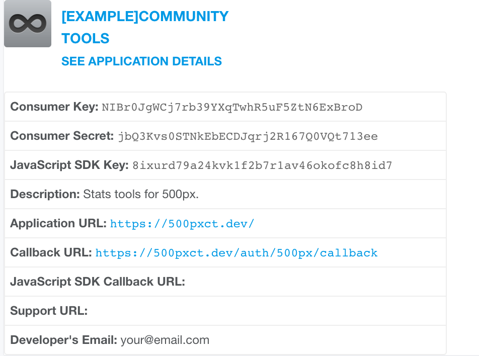

# 500px Community Toolkit 
> A suite of tools to help you manage your 500px account and community 

500px Community Toolkit is an open source toolbox for your [500px](https://500px.com) account.

This is still a WIP but the current features are: 
  * Get infos on your most influential followers.
    * Sort them by **affection** and by **followers**
  * Manage all the comments on your photos in one place
    * Quick reply to a comment
    * Get an history of the comments left by a specific user. Useful to detect whose comments are genuine and who is using a bot.

Planned Features :
  * Schedule photos publication.
  * Custom quick-replies
  * Followers search
  
Please note that [500px](https://500px.com) currently offer their own [statistics](https://500px.com/stats) suite to their paid users.

This app does not intend to replicate any of those features. 
I would recommend you [buy a subscription](https://500px.com/upgrade) if you need things like the amount of new followers, new photo views, new profile views, average photo pulse…

## Installing / Getting started

You need a working PHP7 environment and you should configure your web server's document / web root to be the `public` directory. The index.php` in this directory serves as the front controller for all HTTP requests entering your application.

If you want to run the app locally I would recommend using Laravel [Valet](https://laravel.com/docs/5.4/valet) or [Homestead](https://laravel.com/docs/5.4/homestead).

Clone the repo
```shell
git clone git@github.com:monsieurmechant/500px-community-toolkit.git
```

Copy the environment variables file and fill it with your info
```shell
cp .env.example .env
```

You will need to [create an App with 500px](https://500px.com/settings/applications) and get a `Consumer Key` and `Consumer Secret`. 
The `Callback URL` should be `your-app-url.com/auth/500px/callback` 

Example : 


would translate to this in your `.env` file
```
500PX_KEY=NIBr0JgWCj7rb39YXqTwhR5uF5ZtN6ExBroD
500PX_SECRET=jbQ3Kvs0STNkEbECDJqrj2R167Q0VQt713ee
500PX_REDIRECT='/auth/500px/callback' 
```
You will also need to create a [Pusher](https://pusher.com/) app for websockets.

Finish the install.
```shell
composer install --no-dev
php artisan migrate 
yarn
npm run production
```

### Queues, Jobs and Crons
Please note that this app heavily relies on [Laravel Queued Jobs and Events](https://laravel.com/docs/5.4/queues).
You will need to run a listener for the following queues:
  * default
  * comments
  * comments-high
  * photos
  * photos-high
  * followers
  * followers-heavy
 
 Some of the queue jobs can take quite some time (e.g. if you have more than 100k followers) and should be started with and infinite timeout value.
 ```shell
 php artisan queue:listen --timeout=30 --queue=followers-heavy
 ```
  > You can get more info on queues in the [Laravel Documentation](https://laravel.com/docs/5.4/queues).
 
 Some jobs are scheduled to run at definite intervals and are defined in `App\Console\Kernel::schedule`.
 To run the schedule every minutes add the following entry to your Cron tab:
 
 ```
 * * * * * php /path-to-your-project/artisan schedule:run >> /dev/null 2>&1
 ```
 
 > You can get more info on crons and task scheduling in the [Laravel Documentation](https://laravel.com/docs/5.4/scheduling).

## Developing

This is a basic Laravel 5.4 / VueJs 2 app. 
I would recommend you read their respective documentations if you want an in-depth look at how things work under the hood.
  * [Laravel Docs](https://laravel.com/docs/5.4/configuration)
  * [Vue Docs](http://vuejs.org/v2/guide/)
  * [VueX Docs](http://vuex.vuejs.org/)
  
## Tests
Unit test can be run with **phpunit**
 ```shell
vendor/bin/phpunit
 ```
 
Integration tests are run with [Laravel Dusk](https://laravel.com/docs/5.4/dusk)
 ```shell
php artisan dusk
 ```

## Contributing

If you'd like to contribute, please fork the repository and use a feature
branch. Pull requests are warmly welcome.

## Licensing

The code in this project is licensed under GNU General Public License.
